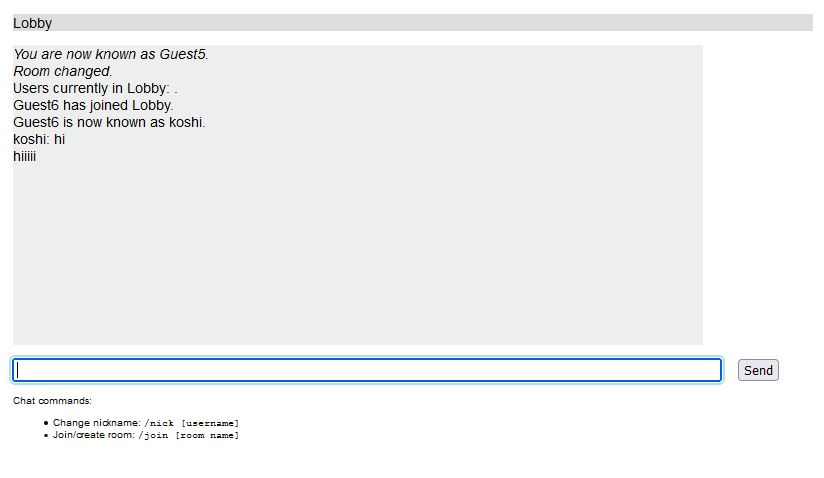
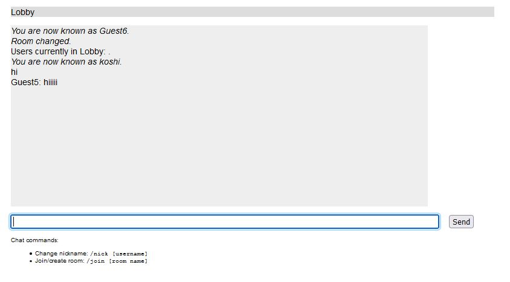

node.js training:
--------------------

this application is based on (Node.js in action) book. 

The application allows users to chat online with each other by entering messages into a simple form. A message, once entered, is sent to all other users in the same chat room.

When starting the application, a user is automatically assigned a guest name, but they can change it by entering a command. Chat commands are prefaced with a slash (/).

Similarly, a user can enter a command to create a new chat room (or join it if it already exists).

----------------------

----------------------

